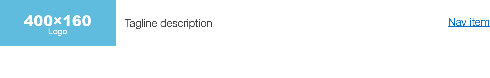
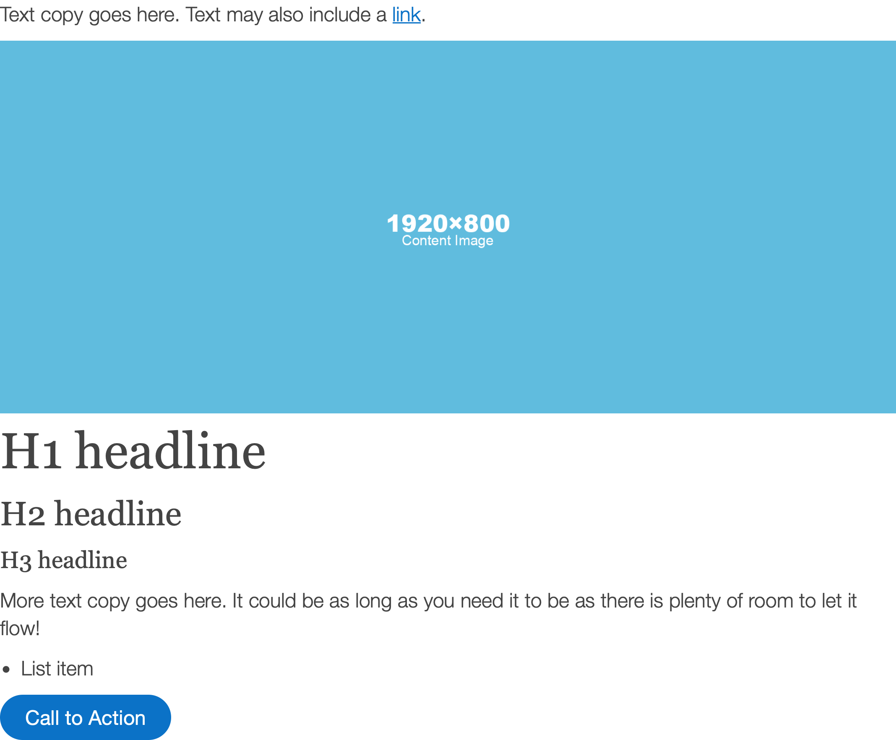
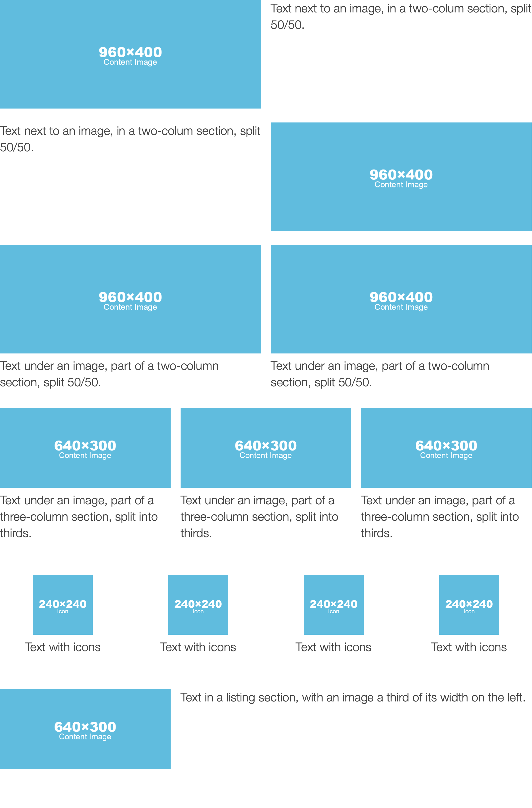

# Starter Page Boilerplate
### A skeleton HTML template of standard layout components for building web pages

A modularly designed boilerplate template that acts as a starting point for your own web pages, with focus on semantics and accessibility, and clean code that works across browsers. It includes essential layouts and components, with minimal styling for you to build on top of.

**Optimized for accessibility**
Semantic elements used for structure.

**Modular design**
Stackable sections and standalone components following modular design practices.

**Responsive adjustments**
Simple CSS media query definitions to adjust layout for mobile across all modules.

## Features ##
- Support for major browsers
- Built semantically with accessibility in mind
- Mobile-responsive ready
- Dark mode compatibility
- Essential pre-built components
- Blocks Edit ready for drag and drop editing

## Browsers tested ##
- Google Chrome
- Firefox
- Apple Safari
- Microsoft Edge

## Components included ##

**Header**

**Components**

**Layouts**

**Footer**

## The frame ##

### Doctype ###

    <!DOCTYPE html>

HTML5 Doctype is enough to trigger standards mode on supported browsers.

### HTML element ###

    <html lang="en">

Set language for browsers, and screen readers. If you need to set language direction, add `dir="ltr"` for left-to-right, or `dir="rtl"` for right-to-left reading.

### Meta ###

    <meta charset="utf-8">
    <meta name="viewport" content="width=device-width, initial-scale=1">
    <meta name="color-scheme" content="light dark">
    <title>Starter Page Boilerplate</title>
    <meta name="apple-mobile-web-app-title" content="Starter">
    <meta name="description" content="Standard layout components for designing and building web pages.">
    <meta name="author" content="Blocks Edit">

- Set the character encoding standard.
- `viewport` element controls the page's dimensions and scaling. This is particularly important for mobile devices, to make sure content is not zoomed in or out.
- `color-scheme` tells the browser dark mode settings. `light dark` means you support both. `light only` means you only support light styling.
- `apple-mobile-web-app-title` allows setting an alternate, shorter title for your website, shown when website is added to the home screen of mobile devices.
- `description` describes the current page, which is used in some search engine results.
- `author` is completely optional, not used for anything functional.

### External includes ###

    <link rel="stylesheet" href="style.css">
    <link rel="icon" href="favicon.ico">
    <link rel="apple-touch-icon" href="appicon.png">

For an external stylesheet, an icon used in browser bookmarks and tabs, and an icon used for the home screen of mobile devices.

### Open graph ###

    <meta property="og:site_name" content="Blocks Edit">
    <meta property="og:type" content="website">
    <meta property="og:url" content="https://blocksedit.com/starter-page-template/">
    <meta property="og:title" content="Starter page template">
    <meta property="og:description" content="Standard layout components for designing and building web pages.">
    <meta property="og:image" content="thumbnail-preview.png">

Used for presenting a preview card for your page, usually for links in social media posts, or in messaging apps.

### Wrapper ###

    <header class="container"> </header>
    <main class="container"> </main>
    <footer class="container"> </footer>

Standard header, body, and footer elements that act as containers for content.

## Standalone components ##

### Fluid image ###

    

Adjusts to column width.

### Titles ###

    <h1>H1 headline</h1>
    <h2>H2 headline</h2>
    <h3>H3 headline</h3>

Primary headlines and subheadlines.

### Text ###

    
More text copy goes here. It could be as long as you need it to be as there is plenty of room to let it flow!

    <ul>
      <li>List item</li>
    </ul>

Paragraph and unordered lists.

### Button ###

    <a href="#" class="btn">Call to Action</a>

## Layout sections ##

### Example section ###

    <section class="row">
      

    
      

      

        Text next to an image, in a two-colum section, split 50/50.
      

    </section>

Uses columns for layout.

## The CSS ##

### Global ###

    /* Global */
    :root {
      color-scheme: light dark;
    
      --primary: #444;
      --secondary: #0b72c7;
      --helvetica: 'Helvetica Neue', 'Helvetica', 'Arial', sans-serif;
      --georgia: 'Georgia', 'Times New Roman', serif;
      --15px: 0.938rem;
      --20px: 1.25rem;
      --22px: 1.375rem;
      --24px: 1.5rem;
      --28px: 1.75rem;
      --30px: 1.875rem;
      --32px: 2rem;
      --40px: 2.5rem;
      --52px: 3.25rem;
      --60px: 3.75rem;
    }
    
    /* Reset */
    *, * :before, * :after {
      margin: 0;
      padding: 0;
      border: 0;
      box-sizing: border-box;
    }
    
    html, body {
      height: 100%;
    }

Main brand colors and font sizes used are set as variables.

### Layout ###

    /* Layout */
    .container {
      margin: 0 auto;
      padding-bottom: 50px;
      width: 80ch;
      text-align: left;
    
      @media (max-width: 990px) {
        width: 100%;
        padding-right: 30px;
        padding-left: 30px;
      }
      @media (max-width: 480px) {
        padding-right: 20px;
        padding-left: 20px;
      }
    }
    
    .row {
      @media (min-width: 480px) {
        display: grid;
        grid-template-columns: repeat(12, 1fr);
        grid-template-rows: 1fr auto;
        gap: 20px;
      }
    }
    
    @media (min-width: 480px) {
      .col-2, .col-3 { grid-column: auto / span 6; }
      .col-4, .col-5, .col-6, .col-7, .col-8, .col-9, .col-10, .col-11, .col-12 { grid-column: auto / span 12; }
    }
    @media (min-width: 600px) {
      .col-2, .col-3, .col-4 { grid-column: auto / span 6; }
      .col-5, .col-6, .col-7, .col-8, .col-9, .col-10, .col-11, .col-12 { grid-column: auto / span 12; }
    }
    @media (min-width: 800px) {
      .col-2 { grid-column: auto / span 2; }
      .col-3 { grid-column: auto / span 3; }
      .col-4 { grid-column: auto / span 4; }
      .col-5 { grid-column: auto / span 5; }
      .col-6 { grid-column: auto / span 6; }
      .col-7 { grid-column: auto / span 7; }
      .col-8 { grid-column: auto / span 8; }
      .col-9 { grid-column: auto / span 9; }
      .col-10 { grid-column: auto / span 10; }
      .col-11 { grid-column: auto / span 11; }
      .col-12 { grid-column: auto / span 12; }
    }

Container and CSS grid layout system setup.

*This template has been put together by the Blocks Edit team. [Blocks Edit](https://blocksedit.com) makes any HTML template editable in a visual editor. So you can setup your own design for your team to build and edit landing pages on their own.*